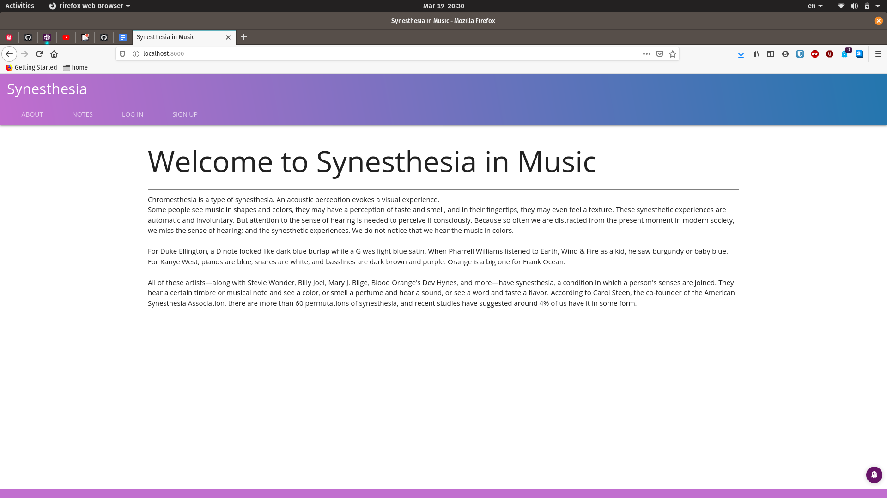

# Synesthesia

## User Story
As a not authorized user I can see a list of musical notes and their details.
I can listen a note and write my name and pick a color or art that I associate with the note.
“Home” and “About” are available for me.
I can register and login.

As an authorized user I can create my own art and note(?needed to be discussed).

## Wireframes
* Not authorized home page

* About Page

* Login

* Signup

* All notes List

* Note Detail

* Associated Art

* Gallery

* Add Picture

## ERD

